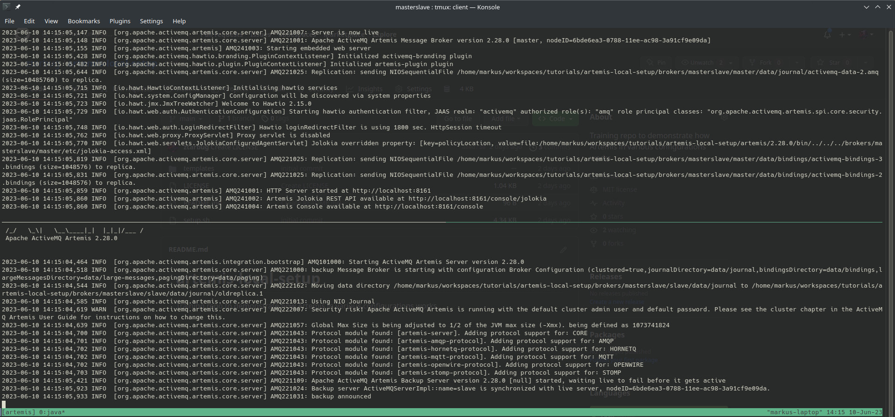

# Artemis Broker Setup(s)
This repository contains scripts, that sets up the Artemis broker in various configurations. Those setups shall serve as tutorials, in which modes Artemis broker can be operated. If you find errros or have proposals for additional variants - pull requests are always appreciated.

## Modes
So far this repo contain setups to run Artemis with Master/Slave mode and with replicated Nodes.

### Master/Slave
In this mode a master instance will be assisted by a hot standby slave instance. That means if master instance goes down, slave will become active. In this sample setup slave runs on the same machine as the master instance and will thus take over all ports opened by the master instance.

You will find generated instances under: 
    
    brokers/masterslave/master
    brokers/masterslave/slave

In each instance folder you can run in subfolder **bin**

    ./artemis run

Consider using TMux to have log outputs of both instances in an compact overview. Following image shows log output of a master/slave config.

### Replica

TODO

## How to setup
Shell setup.sh script will download Artemis and create broker examples. You have to provide a version number such that the desired Artemis release will be used. Sample call

    ./setup.sh 2.28.0

Please note, that this was tested on Linux only. It will probably run on Cygwin or WSL2 on Windos. If you run into issues please open a ticket. 

Pre-requisites: Bash and an internet connection.

## Where to find more info
* Artemis repo https://github.com/apache/activemq-artemis 
* Artemis docu https://activemq.apache.org/components/artemis/

# Sample Client
This repository also contains a sample consumer/producer with which you can test the various setups. More details can be found in folder [jms-demo-client](jms-demo-client)